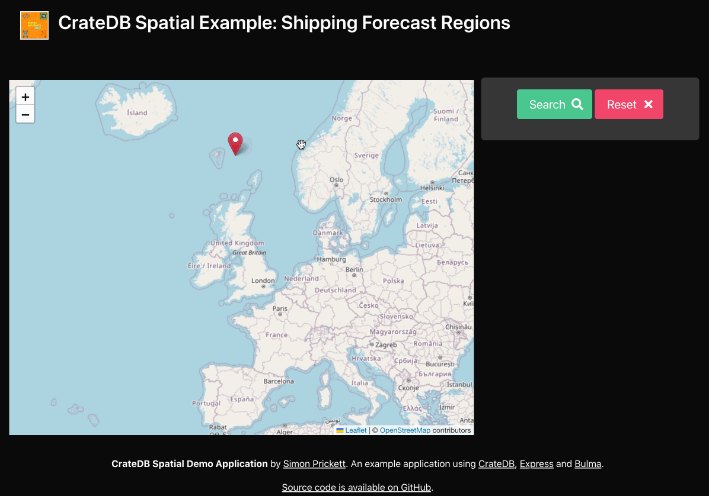

# CrateDB / Express Spatial Data Demo

This is a quick demo showing geospatial functionalityu in CrateDB.  Click on the map to drop a marker then hit search to find out which Shipping Forecast region your marker is in.  Add more markers to plot a course or draw a polygon then hit search to see which regions you're traversing.



If you just want to try this in the cloud without installing it locally, head over to [shippingforecast.simonprickett.dev](https://shippingforecast.simonprickett.dev/).

## Getting Started

Start a local instance of CrateDB with Docker.

```shell
docker-compose up
```

Create the required database schema and load the sample data.

```shell
crash --host 'http://localhost:4200' < init.sql
```

Install the Node/Express application dependencies.

```shell
npm install
```

Start the application.

```shell
npm run dev
```

Navigate to CrateDB Admin to explore the database schema and sample data.

```shell
open http://localhost:4200/
```
